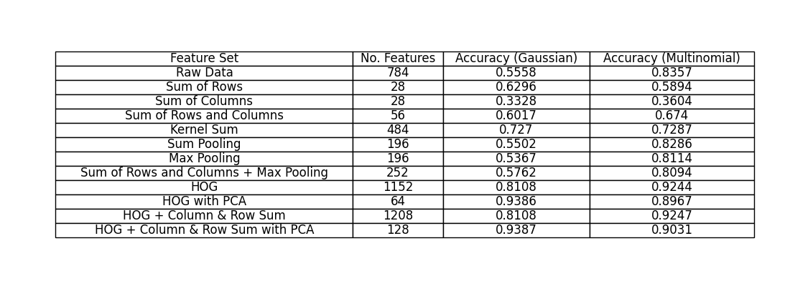

# MNIST Naive Bayes Classifier

[](https://github.com/MMahdiSetak/CartPoleRL/blob/main/LICENSE)

This project is a Naive Bayes classifier for the MNIST dataset, which is a large database of handwritten digits commonly
used for training various image processing systems. The classifier uses different feature extraction techniques to
improve accuracy, including Histogram of Oriented Gradients (HOG), sum pooling, max pooling, and convolution with custom
kernels.

## Features

- Implementation of Naive Bayes classification on the MNIST dataset without the use of advanced machine learning
  techniques.
- Feature extraction techniques to improve model accuracy.
- Parallel computing for efficient feature extraction.
- Visualization of accuracy results for various feature sets.

## Installation

1. Clone this repository to your local machine.
2. Navigate to the project directory and install the required libraries using the `requirements.txt` file:
    ```bash
    pip install -r requirements.txt
    ```
3. Download the MNIST dataset and place it in the `./MNIST` directory. You can download the dataset from:
    - [Yann LeCun's website](http://yann.lecun.com/exdb/mnist/)
    - [Kaggle](https://www.kaggle.com/datasets/hojjatk/mnist-dataset)

## Usage

To run the classifier and reproduce the results, execute:

```bash
python main.py
```

## Results

The accuracy of the classifier with different feature sets is visualized in the `results.png` image. The table
illustrates the performance comparison between the Gaussian Naive Bayes and Multinomial Naive Bayes classifiers.


## Acknowledgments

The code for loading the MNIST dataset is based on
a [Kaggle notebook by HojjatK](https://www.kaggle.com/code/hojjatk/read-mnist-dataset/notebook).

## License

This project is open-source and available under the [MIT License](LICENSE).
